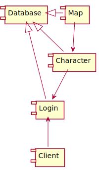
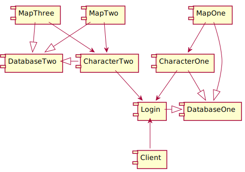

# [rathena-docker](https://github.com/cdelorme/rathena-docker)

A project to demonstrate encapsulated rAthena test environment using docker compose.

**This is not intended for production use as database performance inside of docker is abysmal.**

However, it gives a very clear example of how to configure complex clusters for traffic distribution.

Some might ask why bother throwing rathena inside docker, and here are some reasons:

1.  Newcomers can quickly and easily get a properly isolated running server instance without dealing with dependencies and compilation without being subject to (as much) human error.
2.  Developers can play with complex configurations that may be much harder to achieve on a single host.

The developer support is limited since docker treats builds as immutable and expect one running executable per container.

> The best I could do was allow the project to copy `./rathena` if it exists and compile from there instead of the official repository.  To use this feature as a developer you will need to `docker rmi rathena:test` before each build.

In the end this project only provides a well-isolated rAthena build environment that can be stood up in a single command.

## usage

Standing up the default cluster:

	docker-compose up -d

_To stop the services run:_

	docker-compose stop

**To fully delete the containers run:**

	docker-compose down

Included is an override file to demonstrate a distributed cluster.

To stand that up copy `docker-compose.multi.override.yml` to `docker-compose.override.yml`.

This will override and extend the existing `docker-compose.yml`, adding a second database, second character server, and two new map servers.

### multi

There are some problems with running multiple map servers:

1. The `maps_athena.conf` has no overrides like other import configuration.
2. The `maps_athena.conf` is all-inclusive and may be updated so we don't want to outright replace it.

The solution is therefore to directly access `map2` and `map3`, modify their files, and restart.

These commands will get you logged into each container (separate terminals):

	docker exec -ti map2 bash
	docker exec -ti map3 bash

> You may need to `apt install vim` in order to edit, unless you prefer `cat`/`sed` deletion.

_If you run `down` or delete the containers then you will need to make these changes again._

Instead use:

	docker-compose -f docker-compose.multi.yml stop
	docker-compose -f docker-compose.multi.yml start

You will see errors in the logs pertaining to NPC's since there is no differentiation between what maps are loaded and which NPC's to load.

**As an alternative you can comment out `map3` and have a simpler 1:1 configuration.**

_While I have not tested these personally, a referenced forum thread mentioned bugs with the following:_

- Guild Skill: Emergency Call
- various @commands that depend on state (_which would now be spread across multiple servers_)
- Channel System (_no clarification provided_)
- Guild Storage Duplicationn (eg. atgstorage command)
- root directory `scripts_main.conf` used by map servers; lots of npc warnings at startup

## diagrams

I used [plaintext.com](https://www.planttext.com/) because it made life easy.

### simple

The diagram source for a simple one-server-per-function stack:

	@startuml

	[Login] -left-|> [Database]
	[Character] -left-|> [Database]
	[Character] -down-> [Login]
	[Map] -left-|> [Database]
	[Map] -down-> [Character]
	[Client] -up-> [Login]

	@enduml

_This is the most common type of configuration._

The client connects to the login server using its local configuration to find the address, all connections from there are data driven.

All services talk to a single shared database.

The character server registers with the login server.

The map server registers with the character server.

> The configuration for rAthena actually provides configuration for 5 separate database connections, which means a truly proper configuration would have 5 independent databases.

### multiple

The diagram source for multiple services:

	@startuml

	[Login] -right-|> [DatabaseOne]

	node "First Character Pod" {

	}
	[CharacterOne] -down-|> [DatabaseOne]
	[CharacterOne] -down-> [Login]

	[CharacterTwo] -left-|> [DatabaseTwo]
	[CharacterTwo] -down-> [Login]

	[MapOne] --|> [DatabaseOne]
	[MapOne] --> [CharacterOne]

	[MapTwo] --|> [DatabaseTwo]
	[MapTwo] --> [CharacterTwo]

	[MapThree] --|> [DatabaseTwo]
	[MapThree] --> [CharacterTwo]

	[Client] -up-> [Login]

	@enduml

You can consider each character server, and all map servers that connect to it, to be their own pod.

In a well configured solution, each "pod" would have its own database, and none would share the login database.

However, the services all expect a `log` and `ipban` database, so I went with a slightly compacted implementation that reuses the first database for all three plus the pod.

_Technically the second character server, as well as the second and third map servers, all have the first database connection data for the log and ipban tables._

## future

Here are some things I'd like to do in the future:

- Add [FluxCP](https://github.com/rathena/FluxCP) to the containers (with a `.13` IP)
- Update my original post on the forum to reflect the new release of this project
- Create an updated youtube video demonstrating client and server creation

# references

- [multi-server tutorial](https://rathena.org/board/topic/116483-tutorial-multi-servers/)
- [plaintext.com](https://www.planttext.com/)
